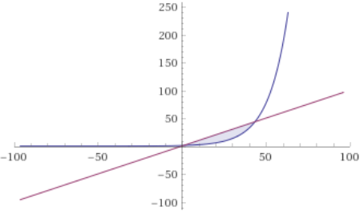
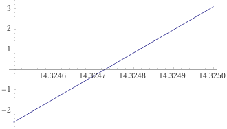

# Content of the chapter

In this chapter we are discovering some utilities of algorithms in computer science, by some kind of data structure and type of algorithms

___
### Exercise 1.1-1
#### Describe your own real-world example that requires sorting. Describe one that requires finding the shortest distance between tow point.
An example of real world sorting algorithm, can be finding the closest city around you, using flight distance, and a limited scope of city.

For example if you have 5 city around you, and you want to know who is the closest. You will first try to get the distance between you and each city then getting the shortest one.

### Exercise 1.1-2
#### Other thar speed, what other measures of efficiency might you need to consider in a real-world setting?
Other than speed in real world, you can have memory complexity used by algorithms.

### Exercise 1.1-3
#### Select a data structure that you have seen, and discuss its strengths and limitations.
Linked list is one of data structure that I have seen in the past. The structure allow you to easily access to the next element of an array. 
But if you want to access to a specific element you will lose a lot of time, because you need to go throw all element before the wanted one.

### Exercise 1.1-4
#### How are the shortest-path and traveling-salesperson problems given above similar? How are they different?
The Shortest-path and Traveling-salesperson are the same on some side like, on both algorithms you need to find the shortest path of a graph.

But the restriction of both algorithms are different, in the Shortest-path algorithms you need to go to point A to B through a graph structure, you will be able to find the solution quicker than in the Traveling-salesperson algorithms.
In the Traveling-salesperson you need to go through a list of point example ABCD without specified order, so here you will need to check a lot more path in the graph than it was for the Shortest-path algorithms.

### Exercise 1.1-5
#### Suggest a real-world problem in which only the best solution will do. Then come up with one which "approximately" the best solution is good enough. 
Only best solution is valid could be a sorting algorithm, where you need to sort an array.
And the approximate solution could be to find the path on a map, Maybe multiple solution exist in your graph, all of them can be return not only the shortest.  

### Exercise 1.1-6
#### Describe a real-world problem in which sometimes the entire input is available before you need to solve the problem, but other times the input is not entirely available in advance and arrives over time.
The entire input can be available for a path finding algorithms, the graph can update, but it's unusual.
Otherwise, if you need to find the maximum temperature of a day, you will need to wait all the data of the current day to come up to define the best temperature.

### Exercise 1.2-1
#### Give an example of an application that requires algorithmic content at the application level, and discuss the function of the algorithms involved.
To render an application, a simple GUI application. Algorithms are used to determine witch component of the application need to be rendered or not.

### Exercise 1.2-2
#### Suppose that for inputs of size *n* on a particular computer, insertion sort runs in *8n2* steps and merge sort runs in *64 n lg(n)* steps. For which values of *n* does insertion sort beat merge sort ? 

*8n2* <= *64 n lg(n)*

*n2* <= *8 n lg(n)*

*n* <= *8 lg(n)*

*n/8* <= *lg(n)*

*n/8* <= *lg(n)*

*2n/8* <= *n*

With this graph we can see the representation of both side of the inequality. With in red *n* and in blue *2n/8*

We can conclude that for *2 < n < 43* insertion is quicker that merged sorting.

### Exercise 1.2-3
#### What is the smallest value of *n* such that on algorithm whose running time is *100n2* runs faster than an algorithms whose running time is *2n* on the same machine?

Here we are trying to solve *100n2* = *2n*

For that we are going to create an equation : *2n* - *100n2* = 0

This graph represent the equation, and we can conclude, that for n = 15, this *100n2* is faster than *2n*

___
### Problem 1-1
#### For each function **f**(n) and time t in the following table, determine the largest size n of a problem that can be solved in time t, assuming that the algorithm to solve the problem takes **f**(n) microseconds.

|      Item       |                    1 second |                      1 minute |                         1 hour |                           1 day |                           1 month |                             1 year |                            1 century |
|:---------------:|----------------------------:|------------------------------:|-------------------------------:|--------------------------------:|----------------------------------:|-----------------------------------:|-------------------------------------:|
 |     *lg n*      | *2106* | *26x107* | *236x108* | *2864x108* | *225920x108* | *2315360x108* | *231556736x108* |
|    &radic;n     |           *1012* |          *36x1014* |         *1296x1016* |        *746496x1016* |         *6718464x1018* |        *994519296x1018* |    *995827586973696x1016* |
|       *n*       |            *106* |            *6x107* |            *36x108* |            *864x108* |             *2592x109* |             *31536x109* |            *31556736x108* |
|    *n lg n*     |                       62746 |                       2801417 |                      133378058 |                      2755147513 |                       71870856404 |                       797633893349 |                       68654697441062 |
| *n2* |                        1000 |                          7745 |                          60000 |                          293938 |                           1609968 |                            5615692 |                             56175382 |
| *n3* |                         100 |                           391 |                           1532 |                            4420 |                             13736 |                              31593 |                               146677 |
| *2n* |                          19 |                            25 |                             31 |                              36 |                                41 |                                 44 |                                   51 |
|      *n!*       |                           9 |                            11 |                             12 |                              13 |                                15 |                                 16 |                                   17 |
