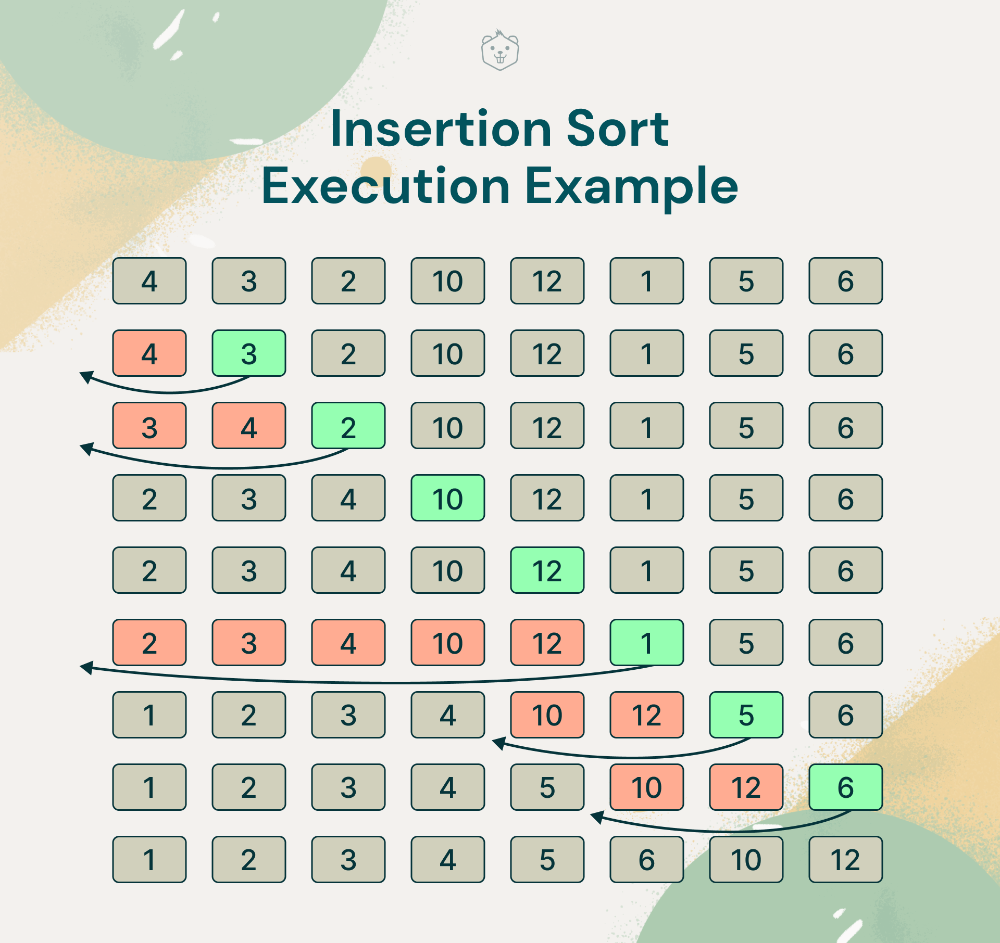
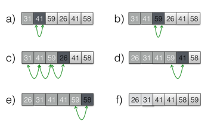

# Content of the chapter

This chapter will cover some basis around complexity and sorting algorithms.

___
## INSERTION-SORT algorithms

This algorithm is usefully for low quantities of values


#### Initialisation
We get the first element of the original array, and we place it in the sorted one.

#### Running
For each element *n* of the unsorted array we check if he is smaller than the *n-1* value, if not we continue to the next value. Else, we are trying to find the right place before the n-1. And insert the value of *n* at this place

At the end of each iteration the sub-array *A[1-i]* need to be always sorted to keep the final output valid.

#### Termination
The algorithm end when you have go throw all the value of the original array.

___
### Exercise 2.1-1
#### Illustrate the operation of INSERTION-SORTof an array initially containing the sequence (31, 41, 59, 26, 41, 58)


### Exercise 2.1-2
#### Consider the procedure SUM-ARRAY on the facing page. It computes the sum of the n numbers in array *A[1:n]*. State a loop invariant for this procedure, and use its initialization, and termination properties to show that the SUM-ARRAY produces returns the sums of the number in *A[1:n]*

```
SUM-ARRAY(A, n)
    sum = 0
    for i = 1 to n
        sum = sum + A[i]
    return sum
```

Loop invariant : 
- <u>Initialization :</u> The sum equals 0.
- <u>Maintenance :</u> The sum is equal to the previous sum plus current value of the array.
- <u>Termination :</u> The sum is equal to all the value contain in A.

### Exercise 2.1-3
#### Rewrite the INSERTION-SORT procedure to sort into monotonically decreasing instead of monotonically increasing order.

```
INSERTION-SORT(A,n)
    for i = 2 to n
        key = A[i]
        // Insert A[i] into the sorted subarray A[i: i-1]
        j = i-1
        while j> 0 and A[j] > key
            A[j+1] = A[j]
            j = j-1
        A[j+1] = key
```

```
REVERSED-INSERTION-SORT(A,n)
    for i = 2 to n
        key = A[i]
        // Insert A[i] into the sorted subarray A[i: i-1]
        j = i-1
        while j> 0 and A[j] < key
            A[j+1] = A[j]
            j = j-1
        A[j+1] = key
```
See solution in [java](resources/java/src/InsertionSort.java) or [rust](resources/rust/src/insertion_sort.rs)

### Exercise 2.1-4
#### Consider the searching problem : 
- **Input** : A sequence of number *n* (a<sub>1</sub>, a<sub>2</sub>,...,a<sub>n</sub>) stored in array *A[1:n]* and a value *x*
- **Output** : An index i such that x equals *A[i]* or the special value *NIL* if x does not appear in *A*.

```
FIND(A,n,x)
    for i = 1 to n
        if A[i] == x
            return i
    return NIL
```

See solution in [java](resources/java/src/LinearSearch.java) or [rust](resources/rust/src/linear_search.rs)

### Exercise 2.1-5
#### Consider the problem of adding tow *n-bit* binary integers *a* and *b*.
- **Input** : Tow *n-bit* binary integers *a* and *b*, stored in tow *n-element* arrays *A[0 : n-1]* and *B[0 : n-1]*, where each element is either *0* or *1*
- **Output** : An array *C[0 : n]* who represent the binary addition of *a* and *b*

```
ADD-BINARY-INTEGER(A,B,n) -> C
    C = Array[n]
    remainder = 0
    for i = n to 1 by -1
        C[i] = (A[i-1] + B[i-1] + remainder) % 2
        remainder = (A[i-1] + B[i-1] + remainder) / 2
    C[0] = remainder
```

See solution in [java](resources/java/src/AddBinaryInteger.java) or [rust](resources/rust/src/linear_search.rs)
___
## Analysis of algorithms

### Exercise 2.2-1
#### Express the function *n<sup>3</sup>/1000 + 100n<sup>2</sup> - 100n + 3* in terms of θ-notation.

Here we can ignore all the terms of the equation and take only *n<sup>3</sup>/1000* this one. Because *n<sup>3</sup>/1000* become greater than other member of the equations for *n* equals to *100000*
We can assume that this function is *θ(n<sup>3</sup>)* because we can also ignore the division.

### Exercise 2.2-2
#### Consider sorting *n* numbers stored in array *A[1 : n]* by first finding the smallest element of *A[1 : n]* and exchanging it withe element in *A[i]*. Then find the smallest element of *A[2 : n]*, and exchange it with *A[2]*. Then find the smallest element of *A[3 : n]*, and exchange it with *A[3]*. Continu in this manner for the first *n-1* elements of *A*. Write pseudocode for this algorithm, which is known as *Selection sort*. 
- What loop invariant does this algorithm maintain ?
- Why does it need to run for only the first *n-1* elements, rather than for all n elements ?
- Give the worst case running time of selection sort in θ-notation.
- Is the best case running time any betters ?

```
SELECTION-SORT(A,n)
    for i = 2 to n-1
        small = i       
        for j = i to n
            if A[small] < A[j] : 
                small = j
        tmp = A[small]
        A[small] = A[i]
        A[i] = tmp
```
See solution in [java](resources/java/src/SelectionSort.java) or [rust](resources/rust/src/selection_sort.rs)

##### What loop invariant does this algorithm maintain ?
Loop invariant :
- <u>Initialization :</u> The array is unsorted.
- <u>Maintenance :</u> the *i* fist elements of the array is sorted.
- <u>Termination :</u> The array is sorted.

##### Why does it need to run for only the first *n-1* elements, rather than for all n elements ?
In the inner loop we are looking for the smallest value of *A[i : n]* and swapping the smallest value with value of *A[i]*, so at the end of the main loop the *A[n]* with be the greatest value of *A*, and we don't need to check anything to be sure that the *A[n]* as the greater value of *A* 

##### Give the worst case running time of selection sort in θ-notation.
The main loop iterate *n* times, and the inner loop iterate *nm* times, where *m* is *n-i* 
So, selection sort got a complexity of *θ(n<sup>2</sup>)* because the worst value of *m* is *n* 

##### Is the best case running time any betters ?
No, this algorithm doesn't have any breaking loop, so the worst case is the best case.

### Exercise 2.2-3
#### Consider linear search again (see [exercise 2.1-4](#exercise-21-4)).
- How many elements of the input array need to be checked on the average, assuming that the element being searched for is equally likely to be any element in the array? 
- How about in the worst case ?
- Using θ-notation, give the average-case and worst case, running times of linear search. Justify your answers.

##### How many elements of the input array need to be checked on the average, assuming that the element being searched for is equally likely to be any element in the array?
On an average case, the search value would be in the middle of array, 50% of elements will be before and 50% after, the search value. So on average case we need to check *n/2* element to find our value.

##### How about in the worst case ?
The worst case means that the value isn't in our array, then we will iterate over all our value then return *NIL* so for the worst case we will check all the *n* elements of the array.

##### Using θ-notation, give the average-case and worst case, running times of linear search. Justify your answers.
- Average case : As we have saied, on the average we are going to iterate on *n/2* elements, so it's means *θ(n)*
- Worst case : Because we iterate over all the value of the array we have a complexity of *θ(n)*

### Exercise 2.2-4
#### How can you modify any sorting algorithm to have a good best-case running time ?
Using a divide-and-conquer strategy can be a solution to optimise the running time.