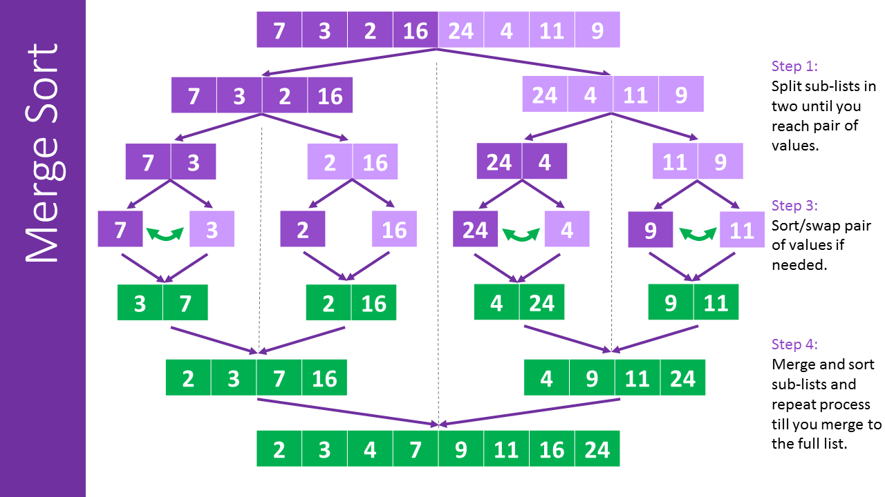
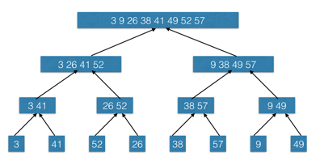
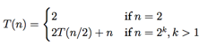

# Content of the chapter

This chapter will cover some basis around complexity and sorting algorithms.

___

## INSERTION-SORT algorithms

This algorithm is usefully for low quantities of values


#### Initialisation

We get the first element of the original array, and we place it in the sorted one.

#### Running

For each element *n* of the unsorted array we check if he is smaller than the *n-1* value, if not we continue to the
next value. Else, we are trying to find the right place before the n-1. And insert the value of *n* at this place

At the end of each iteration the sub-array *A[1-i]* need to be always sorted to keep the final output valid.

#### Termination

The algorithm end when you have go throw all the value of the original array.

___

### Exercise 2.1-1

#### Illustrate the operation of INSERTION-SORTof an array initially containing the sequence (31, 41, 59, 26, 41, 58)


### Exercise 2.1-2

#### Consider the procedure SUM-ARRAY on the facing page. It computes the sum of the n numbers in array

*A[1:n]*. State a loop invariant for this procedure, and use its initialization, and termination properties to show that
the SUM-ARRAY produces returns the sums of the number in
*A[1:n]*

```
SUM-ARRAY(A, n)
    sum = 0
    for i = 1 to n
        sum = sum + A[i]
    return sum
```

Loop invariant :

- <u>Initialization</u> : The sum equals 0.
- <u>Maintenance</u> : The sum is equal to the previous sum plus current value of the array.
- <u>Termination</u> : The sum is equal to all the value contain in A.

### Exercise 2.1-3

#### Rewrite the INSERTION-SORT procedure to sort into monotonically decreasing instead of monotonically increasing order.

```
INSERTION-SORT(A,n)
    for i = 2 to n
        key = A[i]
        // Insert A[i] into the sorted subarray A[i: i-1]
        j = i-1
        while j> 0 and A[j] > key
            A[j+1] = A[j]
            j = j-1
        A[j+1] = key
```

```
REVERSED-INSERTION-SORT(A,n)
    for i = 2 to n
        key = A[i]
        // Insert A[i] into the sorted subarray A[i: i-1]
        j = i-1
        while j> 0 and A[j] < key
            A[j+1] = A[j]
            j = j-1
        A[j+1] = key
```

See solution in [java](resources/java/src/sort/InsertionSort.java) or [rust](resources/rust/src/sort/insertion_sort.rs)

### Exercise 2.1-4

#### Consider the searching problem :

- **Input** : A sequence of number *n* (a<sub>1</sub>, a<sub>2</sub>,...,a<sub>n</sub>) stored in array *A[1:n]* and a
  value *x*
- **Output** : An index i such that x equals *A[i]* or the special value *NIL* if x does not appear in *A*.

```
FIND(A,n,x)
    for i = 1 to n
        if A[i] == x
            return i
    return NIL
```

See solution in [java](resources/java/src/search/LinearSearch.java)
or [rust](resources/rust/src/search/linear_search.rs)

### Exercise 2.1-5

#### Consider the problem of adding tow *n-bit* binary integers *a* and *b*.

- **Input** : Tow *n-bit* binary integers *a* and *b*, stored in tow *n-element* arrays *A[0 : n-1]* and *B[0 : n-1]*,
  where each element is either *0* or *1*
- **Output** : An array *C[0 : n]* who represent the binary addition of *a* and *b*

```
ADD-BINARY-INTEGER(A,B,n) -> C
    C = Array[n]
    remainder = 0
    for i = n to 1 by -1
        C[i] = (A[i-1] + B[i-1] + remainder) % 2
        remainder = (A[i-1] + B[i-1] + remainder) / 2
    C[0] = remainder
```

See solution in [java](resources/java/src/misc/AddBinaryInteger.java)
or [rust](resources/rust/src/search/linear_search.rs)
___

## Analysis of algorithms

### Exercise 2.2-1

#### Express the function *n<sup>3</sup>/1000 + 100n<sup>2</sup> - 100n + 3* in terms of θ-notation.

Here we can ignore all the terms of the equation and take only *n<sup>3</sup>/1000* this one. Because *n<sup>3</sup>
/1000* become greater than other member of the equations for *n* equals to *100000*
We can assume that this function is *θ(n<sup>3</sup>)* because we can also ignore the division.

### Exercise 2.2-2

#### Consider sorting *n* numbers stored in array *A[1 : n]* by first finding the smallest element of

*A[1 : n]* and exchanging it withe element in *A[i]*. Then find the smallest element of *A[2 : n]*, and exchange it with
*A[2]*. Then find the smallest element of *A[3 : n]*, and exchange it with *A[3]*. Continue in this manner for the first
*n-1* elements of *A*. Write pseudocode for this algorithm, which is known as *Selection sort*.

- What loop invariant does this algorithm maintain ?
- Why does it need to run for only the first *n-1* elements, rather than for all n elements ?
- Give the worst case running time of selection sort in θ-notation.
- Is the best case running time any betters ?

```
SELECTION-SORT(A,n)
    for i = 2 to n-1
        small = i       
        for j = i to n
            if A[small] < A[j] : 
                small = j
        tmp = A[small]
        A[small] = A[i]
        A[i] = tmp
```

See solution in [java](resources/java/src/sort/SelectionSort.java) or [rust](resources/rust/src/sort/selection_sort.rs)

##### What loop invariant does this algorithm maintain ?

Loop invariant :

- <u>Initialization</u> : The array is unsorted.
- <u>Maintenance</u> : the *i* fist elements of the array is sorted.
- <u>Termination</u> : The array is sorted.

##### Why does it need to run for only the first *n-1* elements, rather than for all n elements ?

In the inner loop we are looking for the smallest value of *A[i : n]* and swapping the smallest value with value of
*A[i]*, so at the end of the main loop the *A[n]* with be the greatest value of *A*, and we don't need to check anything
to be sure that the *A[n]* as the greater value of *A*

##### Give the worst case running time of selection sort in θ-notation.

The main loop iterate *n* times, and the inner loop iterate *nm* times, where *m* is *n-i*
So, selection sort got a complexity of *θ(n<sup>2</sup>)* because the worst value of *m* is *n*

##### Is the best case running time any betters ?

No, this algorithm doesn't have any breaking loop, so the worst case is the best case.

### Exercise 2.2-3

#### Consider linear search again (see [exercise 2.1-4](#exercise-21-4)).

- How many elements of the input array need to be checked on the average, assuming that the element being searched for
  is equally likely to be any element in the array?
- How about in the worst case ?
- Using θ-notation, give the average-case and worst case, running times of linear search. Justify your answers.

##### How many elements of the input array need to be checked on the average, assuming that the element being searched for is equally likely to be any element in the array?

On an average case, the search value would be in the middle of array, 50% of elements will be before and 50% after, the
search value. So on average case we need to check *n/2* element to find our value.

##### How about in the worst case ?

The worst case means that the value isn't in our array, then we will iterate over all our value then return *NIL* so for
the worst case we will check all the *n* elements of the array.

##### Using θ-notation, give the average-case and worst case, running times of linear search. Justify your answers.

- Average case : As we have saied, on the average we are going to iterate on *n/2* elements, so it's means *θ(n)*
- Worst case : Because we iterate over all the value of the array we have a complexity of *θ(n)*

### Exercise 2.2-4

#### How can you modify any sorting algorithm to have a good best-case running time ?

Using a divide-and-conquer strategy can be a solution to optimise the running time.

___

## Designing algorithms

## MERGE-SORT algorithms

This algorithm has a complexity of *θ(n lg(n))*


#### Divide

We divide the array *A[p : r]* to 2 adjacent sub-array, we get the midpoint q of *A[p : r]*, and we divide *A[p : r]*
into sub-arrays *A[p : q]* and *A[q+1 : r]*

#### Conquer

By sorting each of the 2 sub-arrays *A[p : q]* and *A[q+1 : r]* recursively using merge sort

#### Combine

We merged the 2 sub-arrays *A[p : q]* and *A[q+1 : r]* back into *A[p : r]* producing the sorted answer.

To optimise this strategy we can divide recursively until we got sub-array of size 2 (or 1) to get a linear comparison
time.

```
MERGE(A,p,q,r)
    nl = q - p + 1
    nr = r - q
    
    let L[0 : nl - 1] and R[0 : nr - 1] the new arrays
    for i = 0 to nl - 1
        L[i] = A[p + i]
    for j = 0 to nr - 1
        L[j] = A[q + j + 1]
    i = 0
    j = 0
    k = p
    
    while i < nl and j < nr
        if L[i] <= R[j]
            A[k] = L[i]
            i = i + 1
        else 
            A[k] = R[j]
            j = j + 1
        k = k + 1
        
    while i < nl
         A[k] = L[i]
         i = i + 1
         k = k + 1
     
     while j < nr
         A[k] = R[j]
         j = j + 1
         k = k + 1
```

```
MERGE-SORT(A,p,r)
    if p >= r
        return
    q = |(p+r)/2|
    MERGE-SORT(A,p,q)
    MERGE-SORT(A,q+1,r)
    MERGE(A,p,q,r)
```

### Exercise 2.3-1

#### Illustrate the operation of merge sort on an array initially containing the sequence (3,41,52,26,38,57,9,49)



### Exercise 2.3-2

#### The test in line 1 of the MERGE-SORT procedure reads *"if p >= r"* rather than *"if p !=

r"*. If MERGE-SORT is called with *p > r*, then he sub-array
*A[p : r]* is empty. Argue that as long as the initial call of MERGE-SORT (A,1,n) has n >= 1, the test *"if p !=
r"* suffices to ensure that no call has *p > r*

Because we have avoided empty array with the constraint *n >= 1* we can assume that all our sub-arrays will have a
length greater or equals to 1, and to check if we have an array of one element we can check if *p* and *r* are equals.

### Exercise 2.3-3

#### State a loop invariant for the while loop of lines

*12-18* of the MERGE procedure. Show how to use it, along with the while loops of lines *20-23* and
*24-27*, to prove that the MERGE procedures is correct.

Loop invariant :

- <u>Initialization</u> : Tow sub-array sorted and a main array unsorted.
- <u>Maintenance</u> : The *k* fist elements of the main array is sorted, and came from the sub-arrays
- <u>Termination</u> : The main array is sorted.

### Exercise 2.3-4

#### Use mathematical induction to show that when *n >= 2* is an exact power of 2, the solution of the recurrence is *T(

n) = n lg n*



*F(k) = T(2<sup>k</sup>)*<br/>
*F(1) = T(2) = 2 = 2lg2 = 2<sup>1</sup>lg2<sup>1</sup>*<br/>
*F(k) = 2<sup>k</sup>lg2<sup>k</sup>*<br/>
*F(k + 1) = T(2<sup>k+1</sup>)*<br/>
*= 2T(2<sup>k</sup>) + 2<sup>k+1</sup>*<br/>
*= 2 x 2<sup>k</sup>lg2<sup>k</sup> + 2<sup>k+1</sup>*<br/>
*= 2<sup>k+1</sup>(lg 2<sup>k</sup>+1)*<br/>
*= 2<sup>k+1</sup>(lg 2<sup>k</sup> + lg 2)*<br/>
*= 2<sup>k+1</sup> lg 2<sup>k+1</sup>)*

### Exercise 2.3-5

#### You can also think of insertion sort as recursive algorithm. In order to sort

*A[1 : n]*, recursively sort the sub-array *A[1:n-1]* and then insert *A[n]* into the sub-array
*A[1:n-1]*. Write pseudocode for this recursive version of insertion sort. Give a recurrence for its worst-case running
time.

````
REC-INSERTION-SORT(A,n)
    if n <= 1
        return;

    REC-INSERTION-SORT(A, n-1)
    
    current = A[n]
    i = n-1
    
    while i > 1 and A[i] > current 
        A[i + 1] = A[i]
        i--
    A[i + 1] = current
````

See solution in [java](resources/java/src/sort/InsertionSort.java) or [rust](resources/rust/src/sort/insertion_sort.rs)

The Worst case running time is equal to :

*T(n) = T(n-1) + θ(n)*

Where *T(n)* represents the worst-case running time to sort an array of size n. The *T(n-1)* term represents the time to
sort the sub-array *A[1:n-1]*, and the *θ(n)* term represents the time to insert *A[n]* into the sorted sub-array
*A[1:n-1]*.

Using tree method we can solve this recurrence to determine the complexity of this algorithms

We can draw the following tree, where each node represent a step of the recurrence

                            T(4)
                          /  |  \
                      T(3) T(2) T(1)
                     /  | \
                 T(2) T(1) T(0)
                /  \
            T(1) T(0)

For each level of the tree we perform an *θ(n)* operation, where *n* is the size of the sub-problem

````
    Level 0: θ(4) = 4
    Level 1: θ(3) = 3
    Level 2: θ(2) = 2
    Level 3: θ(1) = 1
````

There are *n* sub-problems of size *1*, *n-1* sub-problems of size *2*, and so on, down to *1* sub-problem of size *n*.
So the number of nodes at each level is:

````
    Level 0: 1 node
    Level 1: 3 nodes
    Level 2: 6 nodes
    Level 3: 10 nodes
````

Multiplying the cost and number of nodes at each level, we get:

````
    Level 0: 1 * 4 = 4
    Level 1: 3 * 3 = 9
    Level 2: 6 * 2 = 12
    Level 3: 10 * 1 = 10
````

Adding up the total cost of all the levels, we get:

````
    Total cost = 4 + 9 + 12 + 10 = 35
````

So the worst-case running time of the recursive version of insertion sort is *θ(n^2)*, as we saw earlier.

### Exercise 2.3-6

#### Referring back to the searching problem (see Exercise 2.1-4), observe that if the sub-array being search is already sorted, the searching algorithm can check the midpoint of the sub-array against

*v* and eliminate half of the sub-array from further consideration. The *binary
search* algorithm repeats this procedure, having the size of the remaining portion of the sub-array each time. Write
pseudocode, either iterative or recursive, for binary search. Argue that the worst-case running time of binary-search is
*θ(lg n)*.

````
BINARY-SEARCH(A, n, x)
    return BINARY-SEARCH-REC(A, 1, n, x)

BINARY-SEARCH-REC(A, h, t, x)
    if t < h
        return -1
        
    int m = h + (t - h) / 2
    
    if A[m] == x
        return m
    else if A[m] > x
        return BINARY-SEARCH-REC(A, h, m-1, x)
    else
        return BINARY-SEARCH-REC(A, m+1, t, x)
````

See solution in [java](resources/java/src/search/BinarySearch.java)
or [rust](resources/rust/src/search/binary_search.rs)

The worst-case running time of binary search is *θ(lg n)*, where *n* is the size of the input array. This is because the
algorithm divides the size of the remaining portion of the sub-array in half each time, resulting in a binary tree of
recursive calls. The maximum height of this tree is *lg n*, and each level of the tree requires a constant amount of
work, resulting in a total worst-case running time of *θ(lg n)*.

### Exercise 2.3-7

#### The `while` loop of line 5-7 of the

*INSERTION-SORT* procedure in section 2.1 uses linear search to scan (backward) through the sorted sub-array
*A[1 : n-1]*. What if *INSERTION SORT* used *Binary Search* (see Exercise 2.3-6) instead of *Linear
Search* ? Would that improve the overall worst-case running time of insertion sort to *θ(n lg n)*

Because the main idea of the insertion sort is to shift all element greater than the current value. Even if we use
binary search to find the correct position, we still need on the worst case to shift all the sorted elements. So if we
need to sort *n* elements and for each of them, we need n operations. We will still have a global complexity equals to
*θ(n^2)*

```
INSERTION-SORT(A,n)
    for i = 2 to n
        key = A[i]
        pos = BINARY-SEARCH-POSITION(A, 1, i-1) (see speudo code above)
        // Insert A[i] into the sorted subarray A[i: i-1]
        for j = i-1 to pos
            tmp = A[j+1]
            A[j+1] = A[j]
            A[j] = tmp
        A[j+1] = key
        
BINARY-SEARCH-POSITION(A, l, r, x)
    while l <= r
        m = (l + r) / 2
        if A[m] == x
            return m
        else if A[m] < x
            l = m + 1
        else 
            r = m - 1
    return l 
```

See solution in [java](resources/java/src/sort/InsertionSort.java) or [rust](resources/rust/src/sort/insertion_sort.rs)

### Exercise 2.3-8

#### Describe an algorithm that, given a set *S* of *n* integers and another integer *x*, determines whether

*S* contains two elements that sum to exactly *x*. Your algorithm should take *θ(n lg n)* time in the worst case.

```
FIND-SUM(A, n, x)
    map = {} 
    for i = 0 to n
        remainder = x - A[i]
        if map.contain(remainder)
            return [map.get(remainder), i]
        
        map.put(A[i], i)

    return []
```

See solution in [java](resources/java/src/misc/FindSum.java) or [rust](resources/rust/src/misc/find_sum.rs)

### Problem